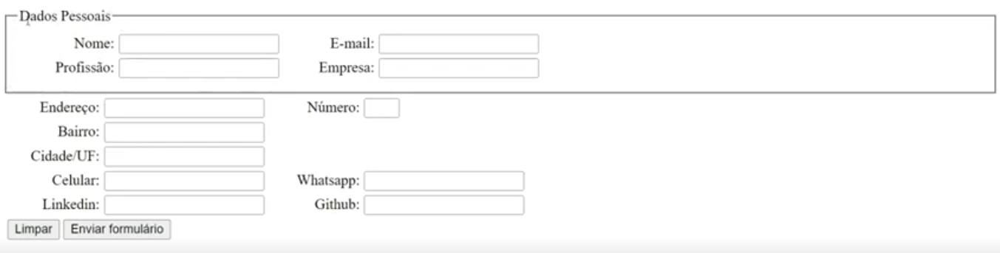

#### Resumo das formatações de texto

#### Tag's de formatação de texto:

* &lt;i&gt; texto em itálico.
* &lt;b&gt; texto em negrito, sem semântica.
* &lt;strong&gt; texto em negrito com semântica, dar preferência a este para mostrar textos que devem ter maior destaque.
* &lt;u&gt; texto sublinhado.
* &lt;mark&gt; texto marcado em amarelo como se fosse marcado com marca texto.
* &lt;sub&gt; texto subscrito.
* &lt;sup&gt; texto sobrescrito.
* &lt;bloquote&gt; É uma citação, coloca um espaçamento no início do parágrafo, utiliza para demarcar por exemplo uma explicação de algum assunto.
* &lt;font color="red"  face="Arial, Tahoma, ..."&gt; é possível definir fonte e seus atributos com a tag fonte, mas o ideal é fazer isso com uso do CSS.
* &lt;div&gt; Tipo display block, ou seja ocupa a linha toda, o bloco inteiro.
* &lt;span&gt; Posso utilizar por exemplo para estilizar no CSS apenas parte de um texto, pois separa como objeto que posso manipular mas não utiliza o bloco todo.
* &lt;fieldset&gt; Utilizado para segmentar um formulário colocando uma borda em volta do segmento e se unir com a tag &lt;legend&gt; acrescenta um "Título" à seção.
    * **Exemplo fildset + legend**

    * **Exemplo código HTML para Fieldset e Legend**
~~~html
    <fieldset>
        <legend>Dados Login</legend>
        <label for="lblnome">Nome:</label>
        <input type="text" name="nome   id="formNome">
        <label for="lblidade">Idade</label>
        <input type="number" name="idade    id="formIdade">
        <label for="lblpassword">Senha: label>
        <input type="password" name="password" id="formPassword">
    </fieldset>
~~~
* &lt;iframe&gt; abre uma espécie de janela para um conteúdo externo como youtube por exemplo, devemos ter atenção quanto a questão sa segurança, mas é um recurso excelente.