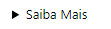
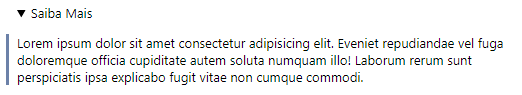
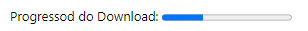
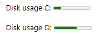

Outros recursos do HTML

> **&lt;datalist>**

A tag especifica uma lista de opções predefinidas para um elemento &lt;input>.&lt;datalist>

A tag é usada para fornecer um recurso de "preenchimento automático" para entrada <> Elementos. Os usuários verão uma lista suspensa de opções predefinidas à medida que inserem dados &lt;datalist>.

O atributo id do elemento deve ser igual ao atributo list do elemento &lt;input> (isso os vincula juntos)&lt;datalist>.

**Exemplo de código:**

```html
<label for="browser">Choose your browser from the list:</label>
<input list="browsers" name="browser" id="browser" />

<datalist id="browsers">
  <option value="Edge"></option>
  <option value="Firefox"></option>
  <option value="Chrome"></option>
  <option value="Opera"></option>
  <option value="Safari"></option>
</datalist>
```

> **&lt;code>**

A tag é usada para definir um pedaço de código de computador. O conteúdo interno é exibido na fonte monoespacial padrão do navegador &lt;code>.

**Exemplo de código:**

```html
<p>The HTML <code>button</code> tag define um botão clicável.</p>
```

> **&lt;kbd>**

A tag é usada para definir a entrada do teclado. O conteúdo interno é exibido na fonte monoespacial padrão do navegador &lt;kbd>.
Para obter um efeito mais rico podemos utilizar o CSS.

**Exemplo de código:**

```html
<p>Press <kbd>Ctrl</kbd> + <kbd>C</kbd>Para copiar o texto.</p>
```

> **&lt;pre>**

A tag é usada para definir a saída de exemplo de um programa de computador. O conteúdo interno é exibido na fonte monoespacial padrão do navegador &lt;samp&gt;.

**Exemplo de código:**

```html
<pre>
    <code>
      animais = [gato, cachorro, papagaio, cobra]
      print(animais[1])
    </code>
    <samp>cachorro</samp>
</pre>
```

> **&lt;details>** &
> **&lt;summary>**

A tag especifica detalhes adicionais que o usuário pode abrir e fechar a pedido.

A tag é frequentemente usada para criar um widget interativo que o usuário pode abrir e fechar. Por padrão, o widget é fechado. Quando aberto, ele se expande, e exibe o conteúdo que está dentro da tag &lt;details&gt;.

**Exemplo de código:**

```html
<details>
  <summary>Saiba Mais</summary>
  <p>
    Lorem ipsum dolor sit amet consectetur adipisicing elit. Eveniet repudiandae
    vel fuga doloremque officia cupiditate autem soluta numquam illo! Laborum
    rerum sunt perspiciatis ipsa explicabo fugit vitae non cumque commodi.
  </p>
</details>
```

A aparência será a seguinte **antes do clique**:



**Após o clique**



> **&lt;mark>** com JS


> **&lt;progress>**

A tag representa o progresso de conclusão de uma tarefa.

Sempre adicione a tag &lt;label> para as melhores práticas de acessibilidade!

É possível utilizar a tag em conjunto com JavaScript para exibir o progresso de uma tarefa.

A tag **não** é adequada para representar um medidor (por exemplo, uso de espaço em disco ou relevância de um resultado de consulta). Para representar um medidor, em vez disso, use a tag &lt;meter>.

**Exemplo de código:**

```html
<label for="file">Downloading progress:</label>
<progress id="file" value="32" max="100">32%</progress>
```

Essa é a aparência no browser:



> **&lt;meter>**

A tag define uma medida escalar dentro de um intervalo conhecido ou um valor fracionário. Isso também é conhecido como um medidor.

Exemplos: Uso do disco, a relevância de um resultado de consulta, etc.

A tag não deve ser usada para indicar o progresso (como em um barra de progresso). Para barras de progresso, use a tag &lt;progress>.

Sempre adicione a tag &lt;label> para as melhores práticas de acessibilidade!

**Exemplo de código:**

```html
<label for="disk_c">Disk usage C:</label>
<meter id="disk_c" value="2" min="0" max="10">2 out of 10</meter><br />

<label for="disk_d">Disk usage D:</label>
<meter id="disk_d" value="0.6">60%</meter>
```
Essa é a aparência no browser:



Esta tag tem vários atributos conforme abaixo:

|Atributo|Valor|Description|
|---|---|---|
|form|form_id|Especifica a qual forma o &lt;meter> elemento pertence.|
|high|number|Especifica o intervalo que é considerado um valor alto.|
|low|number|Especifica o intervalo que é considerado um valor baixo.|
|max|number|Especifica o valor máximo do intervalo.|
|min|number|Especifica o valor mínimo do intervalo. O valor padrão é 0.|
|optimun|number|Especifica qual valor é o valor ideal para o medidor.|
|value|number|**Exigido**, especifica o valor atual do medidor.|


> **&lt;canvas>**

> **Novos no HTML5**
